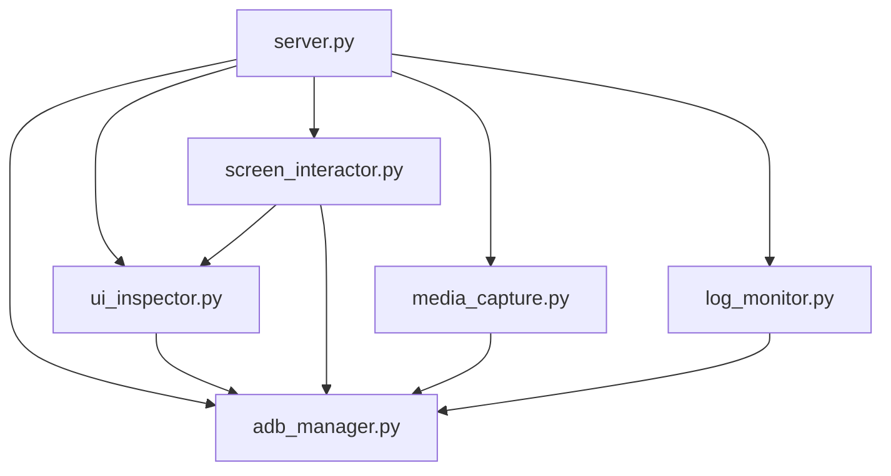

# Android MCP Server Architecture

## Table of Contents
- [System Overview](#system-overview)
- [Core Architecture](#core-architecture)
- [Component Interaction Patterns](#component-interaction-patterns)
- [Data Flow Architecture](#data-flow-architecture)
- [ADB Communication Layer](#adb-communication-layer)
- [Error Handling Architecture](#error-handling-architecture)
- [Extension Points](#extension-points)
- [Design Patterns](#design-patterns)
- [Performance Considerations](#performance-considerations)

## System Overview

The Android MCP Server is a **Model Context Protocol (MCP) server** that provides comprehensive Android device automation capabilities through ADB (Android Debug Bridge). The architecture follows a **layered, component-based design** that separates concerns across different automation domains.

### Key Architectural Principles

1. **Separation of Concerns**: Each module handles a specific automation domain
2. **Single Responsibility**: Components have clear, focused responsibilities
3. **Async-First Design**: All operations are asynchronous for better performance
4. **Error Resilience**: Comprehensive error handling with graceful degradation
5. **Extensibility**: Clear extension points for adding new capabilities

### High-Level Architecture Diagram

```
┌─────────────────────────────────────────────────────────────────┐
│                     MCP Client                                  │
│                 (Claude, VS Code, etc.)                        │
└─────────────────────┬───────────────────────────────────────────┘
                      │ MCP Protocol (JSON-RPC over STDIO)
┌─────────────────────┴───────────────────────────────────────────┐
│                   server.py                                    │
│              FastMCP Server Instance                           │
│           (Tool Registration & Orchestration)                  │
└─────┬───────┬───────┬───────┬───────┬───────┬───────┬──────────┘
      │       │       │       │       │       │       │
      ▼       ▼       ▼       ▼       ▼       ▼       ▼
  ┌────────┐ ┌────────┐ ┌────────┐ ┌────────┐ ┌────────┐ ┌────────┐
  │  ADB   │ │   UI   │ │ Screen │ │ Media  │ │  Log   │ │ Other  │
  │Manager │ │Inspector│ │Interact│ │Capture │ │Monitor │ │Future  │
  └────────┘ └────────┘ └────────┘ └────────┘ └────────┘ └────────┘
      │       │       │       │       │       │
      └───────┼───────┼───────┼───────┼───────┼───────┐
              │       │       │       │       │       │
              ▼       ▼       ▼       ▼       ▼       ▼
        ┌─────────────────────────────────────────────────┐
        │              ADB Command Layer                  │
        │           (Command Standardization)             │
        └─────────────────┬───────────────────────────────┘
                          │
                          ▼
        ┌─────────────────────────────────────────────────┐
        │           Android Device(s)                     │
        │        (Physical/Emulator via ADB)             │
        └─────────────────────────────────────────────────┘
```

## Core Architecture

### Main Components

#### 1. **server.py** - Central Orchestrator
**Role**: MCP server implementation and component coordination
- **FastMCP Integration**: Registers and exposes all tools via MCP protocol
- **Component Lifecycle**: Initializes and manages all subsystem components
- **Tool Orchestration**: Routes MCP tool calls to appropriate components
- **Global State Management**: Maintains component instances and device state

#### 2. **adb_manager.py** - ADB Communication Layer
**Role**: Device communication and command execution
- **Device Discovery**: Lists and selects Android devices
- **Command Execution**: Robust ADB command execution with error handling
- **Device Health**: Monitors device connectivity and responsiveness
- **Command Standardization**: Provides standardized ADB command patterns

#### 3. **ui_inspector.py** - UI Analysis Engine
**Role**: UI hierarchy extraction and element finding
- **XML Parsing**: Parses uiautomator XML dumps into structured data
- **Element Search**: Advanced element finding with multiple criteria
- **UI Traversal**: Recursive UI tree traversal and analysis
- **Element Scoring**: Intelligent element ranking for disambiguation

#### 4. **screen_interactor.py** - Interaction Engine
**Role**: Touch and gesture automation
- **Touch Operations**: Tap, long press, multi-touch gestures
- **Gesture Control**: Swipe, drag, scroll operations
- **Text Input**: Keyboard input and special key handling
- **Coordinate Translation**: Element-to-coordinate mapping

#### 5. **media_capture.py** - Media Operations
**Role**: Screenshot and video recording
- **Screenshot Capture**: Device screen capture with formatting options
- **Video Recording**: Multi-session screen recording with lifecycle management
- **File Management**: Local/remote file handling and cleanup
- **Media Processing**: Optional image highlighting and processing

#### 6. **log_monitor.py** - Log Processing System
**Role**: Real-time log monitoring and analysis
- **Log Streaming**: Continuous logcat monitoring with filtering
- **Log Parsing**: Structured log entry parsing and classification
- **Search Operations**: Log search and pattern matching
- **Background Processing**: Async log processing with callbacks

## Component Interaction Patterns

### 1. **Hierarchical Dependencies**



**Dependency Rules:**
- `server.py` orchestrates all components
- All components depend on `adb_manager.py` for device communication
- `screen_interactor.py` depends on `ui_inspector.py` for element location
- No circular dependencies between components

### 2. **Component Communication Patterns**

#### Pattern A: **Direct Orchestration** (server.py → components)
```python
# Server directly coordinates components
async def tap_element(params: TapElementParams) -> Dict[str, Any]:
    if not screen_interactor:
        await initialize_components()
    return await screen_interactor.tap_element(...)
```

#### Pattern B: **Component Collaboration** (component → component)
```python
# ScreenInteractor uses UIInspector for element finding
class ScreenInteractor:
    def __init__(self, adb_manager: ADBManager, ui_inspector: UILayoutExtractor):
        self.ui_inspector = ui_inspector
        self.element_finder = ElementFinder(ui_inspector)

    async def tap_element(self, ...):
        elements = await self.element_finder.find_elements(...)
```

#### Pattern C: **Shared Dependency** (all → adb_manager)
```python
# All components share ADBManager instance
class UILayoutExtractor:
    def __init__(self, adb_manager: ADBManager):
        self.adb_manager = adb_manager

    async def get_ui_layout(self):
        result = await self.adb_manager.execute_adb_command(command)
```

### 3. **Initialization Flow**

```
1. server.py startup
2. initialize_components() called
3. ADBManager created
4. Device auto-selection
5. Component instances created with ADBManager reference
6. FastMCP server starts listening
```

## Data Flow Architecture

### Request-Response Flow

```
MCP Client Request
        ↓
FastMCP Tool Dispatch
        ↓
Server Tool Handler
        ↓
Component Method Call
        ↓
ADB Command Execution
        ↓
Device Operation
        ↓
Result Processing
        ↓
Structured Response
        ↓
MCP Client Response
```

### Example: UI Element Interaction Flow

```
1. Client: tap_element(text="Login")
2. Server: screen_interactor.tap_element()
3. ScreenInteractor: element_finder.find_elements()
4. ElementFinder: ui_inspector.get_ui_layout()
5. UIInspector: adb_manager.execute_adb_command("uiautomator dump")
6. ADBManager: Execute ADB command
7. UIInspector: Parse XML, return elements
8. ElementFinder: Filter elements, return matches
9. ScreenInteractor: Calculate coordinates, execute tap
10. ADBManager: Execute tap command
11. Server: Return success response
```

### Data Structures

#### Core Data Types

```python
# UI Element representation
@dataclass
class UIElement:
    class_name: str
    resource_id: Optional[str]
    text: Optional[str]
    content_desc: Optional[str]
    bounds: Dict[str, int]  # {left, top, right, bottom}
    center: Dict[str, int]  # {x, y}
    clickable: bool
    enabled: bool
    # ... additional properties

# Standard response format
{
    "success": bool,
    "action": str,
    "data": Any,
    "error": Optional[str]
}
```

## ADB Communication Layer

### Architecture Overview

The ADB communication layer provides a **robust, standardized interface** for all Android device interactions.

#### Key Components

1. **ADBCommands Class** - Command Standardization
2. **ADBManager Class** - Execution Engine
3. **Error Handling** - Resilience Mechanisms
4. **Device Management** - Multi-device Support

### Command Standardization

```python
class ADBCommands:
    """Standardized ADB command patterns with device placeholders."""
    DEVICES_LIST = "adb devices -l"
    DEVICE_INFO = "adb -s {device} shell getprop"
    UI_DUMP = "adb -s {device} shell uiautomator dump"
    TAP = "adb -s {device} shell input tap {x} {y}"
    SCREENSHOT = "adb -s {device} shell screencap -p"
    # ... more commands
```

**Benefits:**
- **Consistency**: All components use same command patterns
- **Maintainability**: Commands defined in single location
- **Device Flexibility**: Template-based device ID injection
- **Command Validation**: Centralized command verification

### Command Execution Flow

```
1. Component requests command execution
2. ADBManager.execute_adb_command() called
3. Device selection validation
4. Command formatting with device ID
5. Shell command parsing (shlex)
6. Async subprocess execution
7. Timeout handling
8. Result processing and error handling
9. Structured response return
```

### Error Handling Mechanisms

#### Execution Error Types

1. **Device Not Found**: No devices connected or selected
2. **Command Timeout**: Operation exceeds time limit
3. **Command Failure**: Non-zero exit code
4. **Parse Error**: Invalid command format
5. **Connection Error**: ADB daemon issues

#### Error Recovery Strategies

```python
async def execute_adb_command(self, command, timeout=30, check_device=True):
    # 1. Device validation with auto-selection
    if check_device and not self.selected_device:
        device_result = await self.auto_select_device()
        if not device_result["success"]:
            return device_result

    # 2. Timeout handling
    try:
        stdout, stderr = await asyncio.wait_for(
            process.communicate(), timeout=timeout)
    except asyncio.TimeoutError:
        return {"success": False, "error": f"Timeout after {timeout}s"}

    # 3. Structured error responses
    return {
        "success": process.returncode == 0,
        "stdout": stdout.decode('utf-8') if stdout else "",
        "stderr": stderr.decode('utf-8') if stderr else "",
        "returncode": process.returncode,
        "command": formatted_command
    }
```

### Device Management

#### Auto-Selection Priority

1. **Previously selected device** (if still connected)
2. **First physical device** with 'device' status
3. **First emulator** with 'device' status
4. **Error** if no devices available

#### Health Monitoring

```python
async def check_device_health(self, device_id):
    health_checks = [
        ("connectivity", "adb -s {device} shell echo 'connected'"),
        ("screen_state", "adb -s {device} shell dumpsys power"),
        ("ui_service", "adb -s {device} shell service check uiautomator"),
    ]
    # Execute checks and return health status
```

## Error Handling Architecture

### Error Handling Philosophy

1. **Fail-Fast Detection**: Identify errors immediately
2. **Graceful Degradation**: Maintain functionality when possible
3. **Context Preservation**: Maintain full error context
4. **User-Friendly Messages**: Clear error communication
5. **Recovery Guidance**: Actionable error resolution

### Error Propagation Patterns

#### Layer-Based Error Handling

```
┌─────────────────┐    ┌─────────────────┐
│   Server Layer  │ ←→ │ User-Facing     │
│   (server.py)   │    │ Error Messages  │
└─────────────────┘    └─────────────────┘
         ↑
┌─────────────────┐    ┌─────────────────┐
│ Component Layer │ ←→ │ Operation-      │
│ (all modules)   │    │ Specific Errors │
└─────────────────┘    └─────────────────┘
         ↑
┌─────────────────┐    ┌─────────────────┐
│   ADB Layer     │ ←→ │ System-Level    │
│ (adb_manager)   │    │ Errors          │
└─────────────────┘    └─────────────────┘
```

#### Error Response Format

```python
# Success Response
{
    "success": True,
    "action": "operation_name",
    "data": {...},
    "metadata": {...}
}

# Error Response
{
    "success": False,
    "action": "operation_name",
    "error": "User-friendly error message",
    "details": "Technical error details",
    "context": {...},  # Operation context
    "suggestions": [...]  # Recovery suggestions
}
```

### Error Categories and Handling

#### 1. **Device Errors**
- **No Devices**: Auto-discovery guidance
- **Device Offline**: Connection troubleshooting
- **Permission Issues**: USB debugging setup

#### 2. **Operation Errors**
- **Element Not Found**: Search criteria refinement
- **Command Timeout**: Device responsiveness issues
- **Invalid Parameters**: Input validation errors

#### 3. **System Errors**
- **ADB Not Found**: Installation guidance
- **Process Errors**: System resource issues
- **Network Errors**: Connection problems

### Component-Specific Error Handling

#### UIInspector Error Handling
```python
async def get_ui_layout(self):
    try:
        # XML parsing with multiple fallback strategies
        result = await self._pull_ui_dump_file()
        if not result:
            return {"success": False, "error": "UI dump retrieval failed"}

        elements = await self._parse_xml_to_elements(result)
        return {"success": True, "elements": elements}

    except ET.ParseError as e:
        return {"success": False, "error": "UI dump parsing failed", "details": str(e)}
    except Exception as e:
        return {"success": False, "error": "UI inspection failed", "details": str(e)}
```

#### MediaCapture Error Handling
```python
class VideoRecorder:
    async def stop_recording(self, recording_id):
        try:
            process.terminate()
            stdout, stderr = await asyncio.wait_for(process.communicate(), timeout=10.0)
            # Success handling...

        except asyncio.TimeoutError:
            # Graceful degradation - force kill if needed
            process.kill()
            return {"success": False, "error": "Recording stop timed out - force killed"}
```

## Extension Points

The architecture provides several **well-defined extension points** for adding new capabilities without modifying core components.

### 1. **New Tool Categories**

#### Adding New Automation Domain

```python
# 1. Create new component module
class DeviceSettings:
    def __init__(self, adb_manager: ADBManager):
        self.adb_manager = adb_manager

    async def get_wifi_status(self) -> Dict[str, Any]:
        # Implementation using adb_manager
        pass

# 2. Register in server.py
settings_manager: Optional[DeviceSettings] = None

async def initialize_components():
    global settings_manager
    settings_manager = DeviceSettings(adb_manager)

# 3. Add MCP tools
@mcp.tool()
async def get_wifi_status() -> Dict[str, Any]:
    if not settings_manager:
        await initialize_components()
    return await settings_manager.get_wifi_status()
```

### 2. **Command Extensions**

#### Adding New ADB Commands

```python
# 1. Extend ADBCommands
class ADBCommands:
    # Existing commands...
    WIFI_STATUS = "adb -s {device} shell dumpsys wifi"
    BLUETOOTH_STATUS = "adb -s {device} shell dumpsys bluetooth_manager"

# 2. Use in components
class DeviceSettings:
    async def get_wifi_status(self):
        result = await self.adb_manager.execute_adb_command(
            ADBCommands.WIFI_STATUS
        )
        return self._parse_wifi_status(result)
```

### 3. **UI Element Extensions**

#### Adding New Element Types

```python
@dataclass
class UIElement:
    # Existing fields...
    custom_attributes: Dict[str, Any] = None
    accessibility_info: Optional[Dict] = None

class ElementFinder:
    async def find_elements_by_accessibility(self, criteria):
        # New finding strategy using accessibility attributes
        pass
```

### 4. **Media Processing Extensions**

#### Adding Image Analysis

```python
class MediaCapture:
    async def take_screenshot_with_analysis(self, analysis_type: str):
        screenshot = await self.take_screenshot()

        # Extension point for image analysis
        if analysis_type == "text_detection":
            text_data = await self._detect_text(screenshot["local_path"])
            screenshot["analysis"] = text_data

        return screenshot

    async def _detect_text(self, image_path: str):
        # OCR integration point
        pass
```

### 5. **Event System Extensions**

#### Adding Event Callbacks

```python
class ComponentBase:
    def __init__(self):
        self.event_callbacks = {}

    def add_event_callback(self, event: str, callback: Callable):
        if event not in self.event_callbacks:
            self.event_callbacks[event] = []
        self.event_callbacks[event].append(callback)

    async def _emit_event(self, event: str, data: Any):
        for callback in self.event_callbacks.get(event, []):
            await callback(data)

# Usage in components
class ScreenInteractor(ComponentBase):
    async def tap_element(self, ...):
        result = await self._perform_tap(...)
        await self._emit_event("element_tapped", result)
        return result
```

## Design Patterns

### 1. **Dependency Injection Pattern**

All components receive their dependencies through constructor injection:

```python
class ScreenInteractor:
    def __init__(self, adb_manager: ADBManager, ui_inspector: UILayoutExtractor):
        self.adb_manager = adb_manager
        self.ui_inspector = ui_inspector
        self.element_finder = ElementFinder(ui_inspector)
```

**Benefits:**
- **Testability**: Easy to mock dependencies
- **Flexibility**: Different implementations can be injected
- **Loose Coupling**: Components depend on abstractions

### 2. **Command Pattern**

ADB operations follow command pattern for consistency:

```python
class ADBCommands:
    TAP = "adb -s {device} shell input tap {x} {y}"

async def execute_tap(x: int, y: int):
    command = ADBCommands.TAP.format(device=device_id, x=x, y=y)
    return await adb_manager.execute_adb_command(command)
```

### 3. **Factory Pattern**

Component initialization uses factory pattern:

```python
async def initialize_components():
    """Factory method for component creation."""
    adb_manager = ADBManager()

    # Auto-select device
    await adb_manager.auto_select_device()

    # Create components with dependencies
    ui_inspector = UILayoutExtractor(adb_manager)
    screen_interactor = ScreenInteractor(adb_manager, ui_inspector)
    # ...
```

### 4. **Observer Pattern**

Log monitoring implements observer pattern:

```python
class LogMonitor:
    def __init__(self):
        self.log_callbacks: List[Callable[[LogEntry], None]] = []

    def add_log_callback(self, callback: Callable):
        self.log_callbacks.append(callback)

    async def _process_log_entry(self, entry: LogEntry):
        for callback in self.log_callbacks:
            await callback(entry)
```

### 5. **Async Context Manager Pattern**

Resource lifecycle management:

```python
class VideoRecorder:
    async def __aenter__(self):
        await self.start_recording()
        return self

    async def __aexit__(self, exc_type, exc_val, exc_tb):
        await self.stop_recording()

# Usage
async with VideoRecorder(adb_manager) as recorder:
    # Recording automatically started and stopped
    await perform_ui_operations()
```

## Performance Considerations

### 1. **Async-First Architecture**

All I/O operations are asynchronous to prevent blocking:

```python
# All ADB operations are async
async def execute_adb_command(self, command: str) -> Dict[str, Any]:
    process = await asyncio.create_subprocess_exec(...)
    stdout, stderr = await process.communicate()

# Background processing for long-running operations
async def start_log_monitoring(self):
    process = await asyncio.create_subprocess_exec(...)
    monitor_task = asyncio.create_task(self._monitor_logs(process))
```

### 2. **Resource Management**

#### Connection Pooling
- **Single ADB Manager**: Shared across all components
- **Device Caching**: Device list cached with TTL
- **Process Lifecycle**: Proper cleanup of background processes

#### Memory Management
```python
class VideoRecorder:
    def __init__(self):
        self.active_recordings: Dict[str, Dict[str, Any]] = {}

    async def stop_recording(self, recording_id: str):
        # Cleanup process resources
        process = self.active_recordings[recording_id]["process"]
        process.terminate()
        await process.communicate()

        # Remove from active recordings
        del self.active_recordings[recording_id]
```

### 3. **Caching Strategies**

#### Device Information Caching
```python
class ADBManager:
    def __init__(self):
        self.devices_cache: Dict[str, Any] = {}
        self._device_cache_ttl = 30  # seconds

    async def list_devices(self):
        # Return cached devices if recent
        if self._is_cache_valid():
            return self.devices_cache
        # Refresh cache
        self.devices_cache = await self._fetch_devices()
```

### 4. **Optimization Techniques**

#### Batch Operations
```python
class ScreenInteractor:
    async def perform_gesture_sequence(self, gestures: List[Dict]):
        """Execute multiple gestures efficiently."""
        for gesture in gestures:
            await self._execute_gesture(gesture)
            await asyncio.sleep(0.1)  # Brief pause between gestures
```

#### Command Optimization
```python
class ADBCommands:
    # Use compressed UI dumps for better performance
    UI_DUMP_COMPRESSED = "adb -s {device} shell uiautomator dump --compressed"

    # Combine commands where possible
    SCREENSHOT_AND_PULL = "adb -s {device} exec-out screencap -p"
```

---

## Architecture Evolution

The architecture is designed to accommodate growth:

1. **Modular Addition**: New components can be added without modifying existing ones
2. **Protocol Evolution**: MCP tool interface can be extended
3. **Platform Support**: Additional platforms (iOS, Windows) could be added
4. **Advanced Features**: AI/ML capabilities can be integrated at component level

This architecture provides a **solid foundation** for Android automation while maintaining **flexibility for future enhancements**.